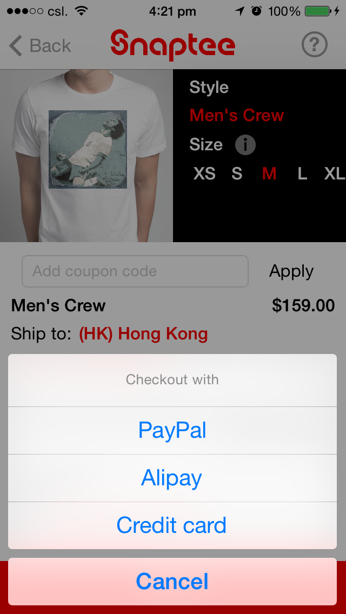
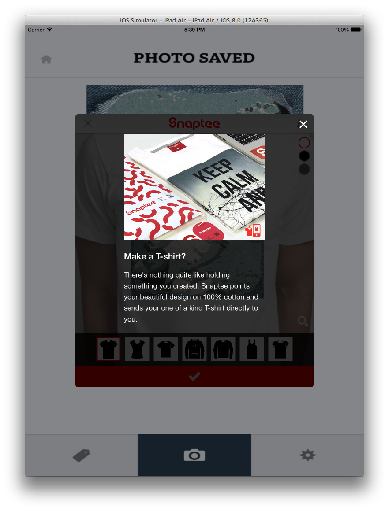
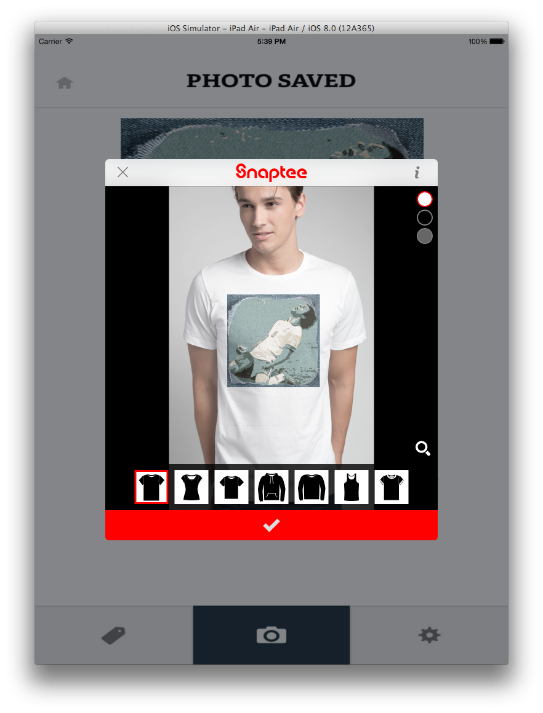
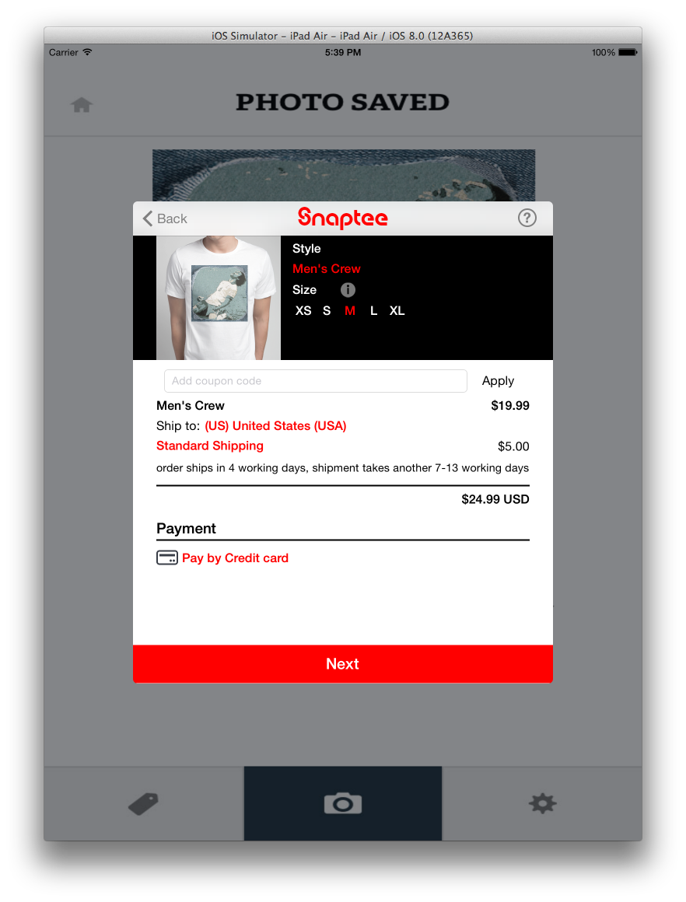
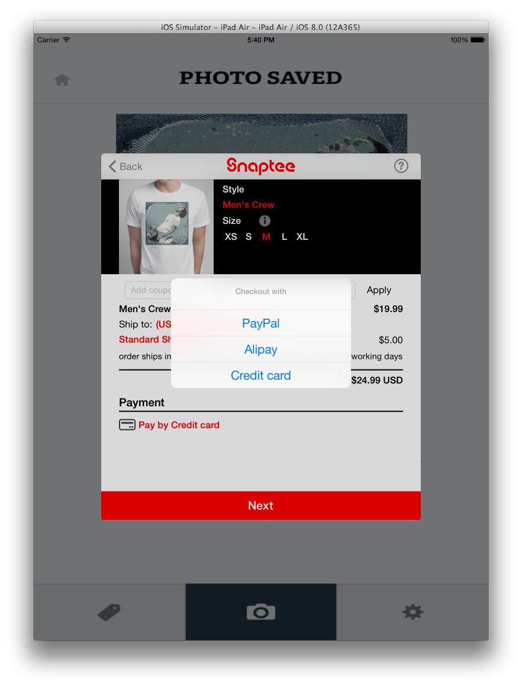
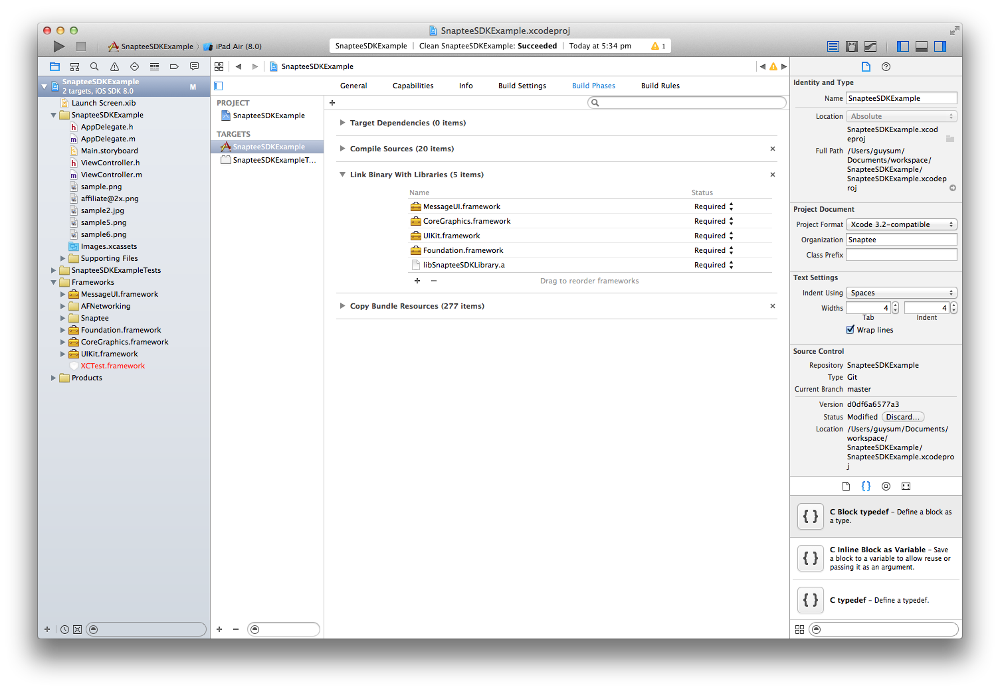

SnapteeSDKExample
=================

iOS Snaptee SDK example project

iPhone version

1. Design T-shirt with the image from your app
    
    

2. Different color and clothing are available to choose
    
    

3. Order the T-shirt directly in the app
    
    

4. Support Credit Card, Paypal and Alipay (Chinese users)
    
    

iPad version

1. Design T-shirt with the image from your app
    
    
2. Different color and clothing are available to choose
    
    
3. Order the T-shirt directly in the app
    
    
4. Support Credit Card, Paypal and Alipay (Chinese users)
    

More screenshots

https://github.com/snaptee/SnapteeSDK-iOS-Example/tree/master/screenshots


To install:

1) Add Snaptee SDK static library to your project
- /Assets/
- /include/
- libSnapteeSDKLibrary.a

2) Add AFNetworking framework (version 2.4.1)
https://github.com/AFNetworking/AFNetworking

3) Add "MessageUI.framework" in "Link Binary With Libraries" in "Build Phases"
    

4) In your app, add the following code to present Snaptee

- Import Snaptee View Controller in your header (.h) and set STViewControllerDelegate if needed
```objc
#import "STViewController.h"
@interface ViewController : UIViewController <STViewControllerDelegate>
@end
```
    
- Initialize Snaptee View Controller

```objc

    /*
     affiliateID: Assigned by Snaptee
     app_name: Optional. Will be shown in the action sheet when leaving Snaptee e.g. "Back to app_name"
     language: force SDK to display in a specific language (STLanguageDefault means to use device's language setting)
     */
    
    [[STAffiliateManager instance] setAffiliate_id:@"sdk-demo"];
    [[STAffiliateManager instance] setApp_name:@"Snaptee SDK Example"]; // Optional
    [[STAffiliateManager instance] setLanguage:STLanguageDefault]; // Optional
    
    /*
     image: UIImage passing to Snaptee
     file type: PNG or JPG
     caption: Optional. Description of the image. Typically entered by users
     */
    STViewController * stViewController = [[STViewController alloc] initWithImage:[UIImage imageNamed:@"sample2.jpg"]
                                                                         fileType:STImageFileTypeJPG
                                                                          caption:@"Funny bear!"];
    [stViewController setST_delegate:self];
    [stViewController setModalPresentationStyle:UIModalPresentationFormSheet];
    
    [self presentViewController:stViewController animated:YES completion:nil];
    
```
- Include the following delegate function to dismiss

```objc
- (void)STViewControllerDidFinish:(STViewController *)viewController{
    [viewController dismissViewControllerAnimated:YES completion:nil];
}
```

- Optional delegate functions for your app to track the status
```objc
- (void)STViewControllerDidSaveDesign:(STViewController *)viewController{
    NSLog(@"Snaptee: Design saved!");
}
- (void)STViewControllerWillCheckout:(STViewController *)viewController{
    NSLog(@"Snaptee: Ready to checkout!");
}
- (void)STViewControllerDidCheckout:(STViewController *)viewController
                               item:(STOrderItem*)orderItem{
    NSLog(@"Snaptee: Order completed, order ID = %@", orderItem.orderId);
    NSLog(@"Snaptee: trackingURL = %@", orderItem.trackingURL);
}

```


To test:

- check out with coupon code when using development ID
- coupon code: st_sandbox
 
Dashboard:

The following website is the dashboard of the program. You may find statistics inside there.
(Username and password are assigned by Snaptee)

http://snaptee.co/affiliate


