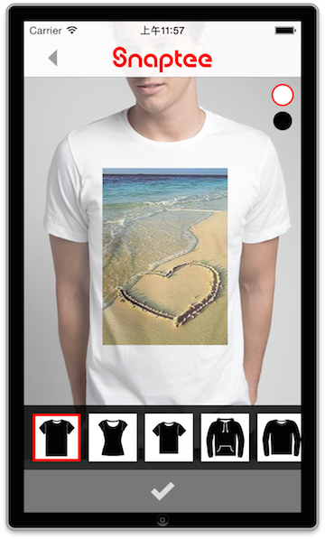
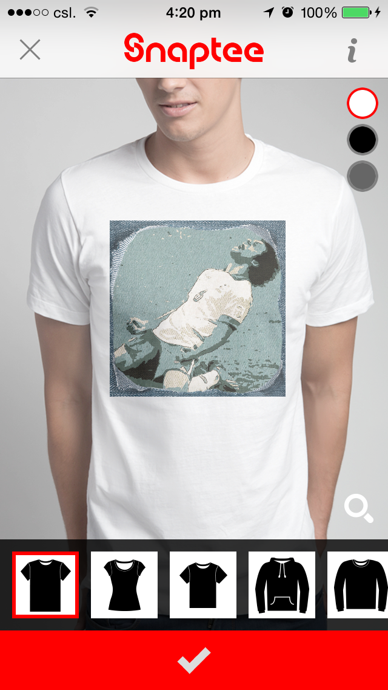
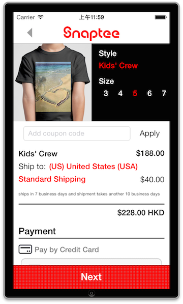
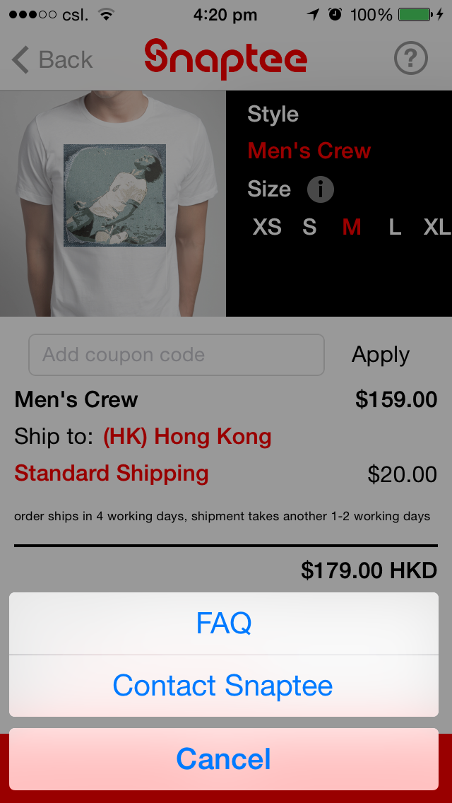

SnapteeSDKExample
=================

iOS Snaptee SDK example project

1. Design T-shirt with the image from your app
    
    

2. Different color and clothing are available to choose
    
    

3. Order the T-shirt directly in the app
    
    

4. User can go back to your app after designing or purchasing T-shirt in Snaptee
    
    


To install:

1) Add Snaptee SDK static library to your project
- /Assets/
- /include/
- libSnapteeSDKLibrary.a

2) Add AFNetworking framework 
https://github.com/AFNetworking/AFNetworking

3) Add Stripe framework 
https://github.com/stripe/stripe-ios

4) In your app, add the following code to present Snaptee

- Import Snaptee View Controller in your header (.h) and set STViewControllerDelegate if needed
```objc
#import "STViewController.h"
@interface ViewController : UIViewController <STViewControllerDelegate>
@end
```
    
- Initialize Snaptee View Controller
    - affiliateID: Assigned by Snaptee
    - app_name: Optional. Will be shown in the action sheet when leaving Snaptee e.g. "Back to app_name"
    - image: UIImage passing to Snaptee
    - image file type: JPG (STImageFileTypeJPG) or PNG (STImageFileTypePNG)
    - caption: Optional. Description of the image. Typically entered by users
```objc
STViewController * stViewController = [[STViewController alloc] initWithAffiliateID:@"my-camera-id"
                                                                           appName:@"My Camera"
                                                                              image:[UIImage imageNamed:@"sample.png"]
                                                                          fileType:STImageFileTypePNG
                                                                            caption:@"Testing Caption!"];
[stViewController setST_delegate:self];
[self presentViewController:stViewController animated:YES completion:nil];
```
- Include the following delegate function if needed

```objc
- (void)STViewControllerWillDismiss:(STViewController *)viewController{
    
    NSLog(@"ST View Will Dismiss");
}
- (void)STViewControllerDidDismiss:(STViewController *)viewController{
    
    NSLog(@"ST View Did Dismiss");
}
```

To test:

- check out with coupon code when using development ID
- coupon code: st_sandbox
 
Dashboard:

The following website is the dashboard of the program. You may find statistics inside there.
(Username and password are assigned by Snaptee)

http://snaptee.co/affiliate


